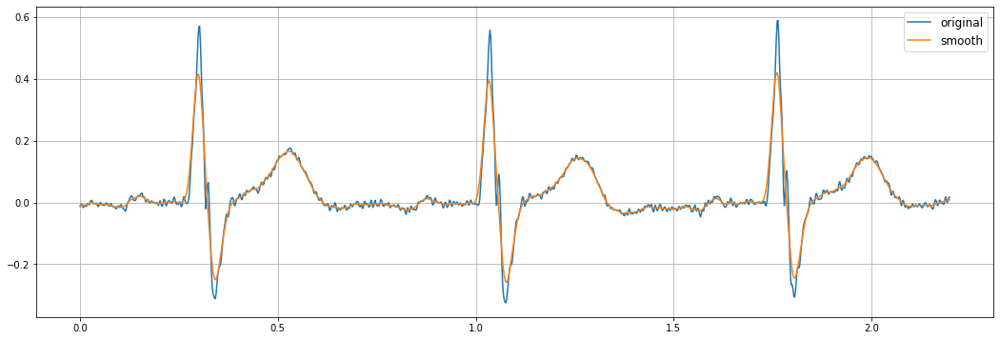
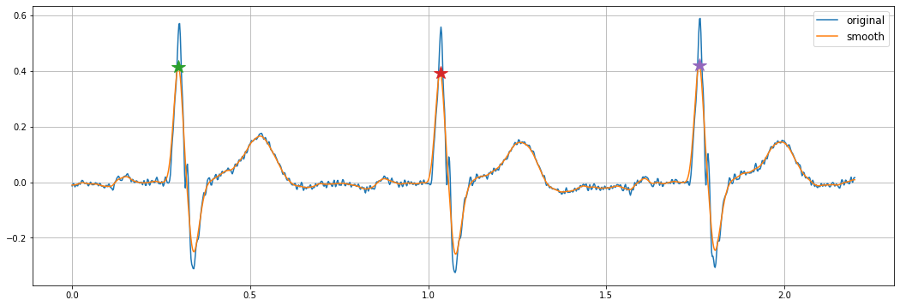

# Find peaks

The interpretation of heart signals starts with an estimation of morphological waveforms, such as P, R, S, T peaks, and QRS/ST-T complexes. Thus, MCGpy provides the basic method to find peak epoch. This page shows an example of how to use it. A more detailed explanation of this method is writtend in the references below.

```python
>>> from mcgpy.timeseries import TimeSeries
>>> data = TimeSeries('~/test/raw/file/path.hdf5', number=1)
```

## Signal Smoothing

To avoid high-frequency noise effects while peak finding, a signal smoothing method is also provided.

```python
>>> data_smooth = data.smooth()
```

```python
>>> import matplotlib.pyplot as plt
>>> fig, ax = plt.subplots(figsize=(18, 6))
>>> ax.plot(times,seg_data)
>>> ax.plot(times,seg_data_smooth)
>>> plt.grid(True)
>>> plt.show()
```

[(plot)](https://github.com/pjjung/mcgpy/blob/gh-pages/imgs/example-findpeaks-1.png)



## Peak finding

```python
>>> peaks = data_smooth.find_peaks()
>>> print(peaks)
[0.29801393 1.03404832 1.76208234] s
```

```python
>>> fig, ax = plt.subplots(figsize=(18, 6))
>>> ax.plot(times,seg_data)
>>> ax.plot(times,seg_data_smooth)
>>> for peak in peaks.value:
      ax.plot(peak, seg_data_smooth.at(peak), marker='*', markersize=16)
>>> plt.grid(True)
>>> plt.show()
```

[(plot)](https://github.com/pjjung/mcgpy/blob/gh-pages/imgs/example-findpeaks-2.png)



## References

* [`mcgpy.timeseriesarray.TimeSeries`](https://pjjung.github.io/mcgpy/Classes/TimeSeries.html)
* [`mcgpy.timeseriesarray.TimeSeriesArray`](https://pjjung.github.io/mcgpy/Classes/TimeSeriesArray.html)
