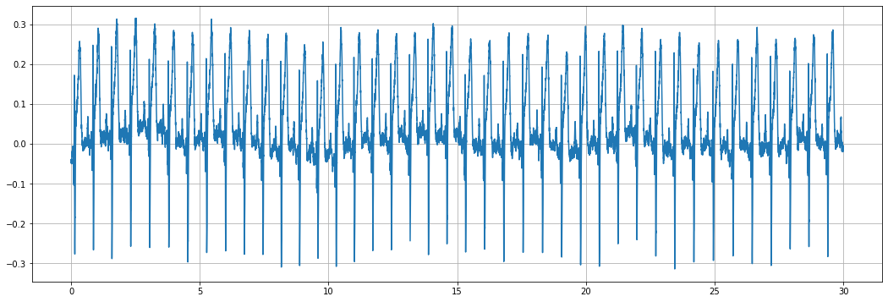
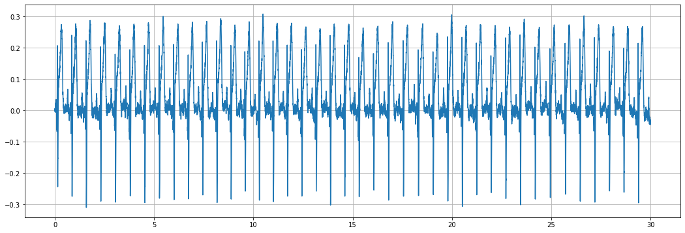

# Signal baseline correction

Signal analysis for the magnetocardiography(MCG) also has no place to avoid baseline wandering issues. Acquired signals consist of not only a magnetic field caused by the electrical activities of a heart but undesirable elements such as background noises, though. The most common reasons for this phenomenon in MCG signals are respiration and subtle moving by a subject. The baseline correction method is essentialy required to minimize these effects.

For this purpose, MCGpy provides the baseline correction method using an asymmetric least squares (ALS). This page shows an example of how to use it. A more detailed explanation is available in the references below.

```python
>>> from mcgpy.timeseries import TimeSeries
>>> data = TimeSeries('~/test/raw/file/path.hdf5', number=1)
```

```python
>>> import matplotlib.pyplot as plt
>>> fig, ax = plt.subplots(figsize=(18, 6))
>>> ax.plot(data)
>>> plt.grid(True)
>>> plt.show()
```

[(plot)](https://github.com/pjjung/mcgpy/blob/gh-pages/imgs/example-flattened-1.png)



## Asymmetric Least Squares (ALS) method

```sh
>>> data_flattened = data.flattened()
>>> fig, ax = plt.subplots(figsize=(18, 6))
>>> ax.plot(data_flattened)
>>> plt.grid(True)
>>> plt.show()
```
[(plot)](https://github.com/pjjung/mcgpy/blob/gh-pages/imgs/example-flattened-2.png)



## References

* [`mcgpy.timeseriesarray.TimeSeries`](https://pjjung.github.io/mcgpy/Classes/TimeSeries.html)
* [`mcgpy.timeseriesarray.TimeSeriesArray`](https://pjjung.github.io/mcgpy/Classes/TimeSeriesArray.html)
* [Shixuan He, et atl., Analytical Methods, 6 (12), 4402, 2014](https://doi.org/10.1039/C4AY00068D)
