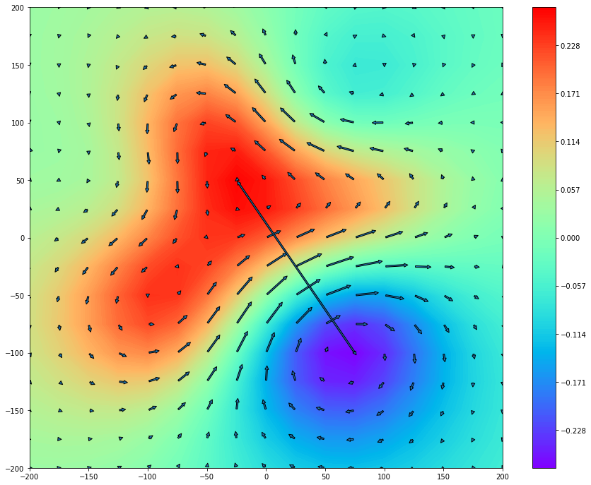

# Arrow Map

Although the [Field Map](https://pjjung.github.io/mcgpy/Visualization/Fieldmap.html) is a scalar dataset, current dipole distribution can be obtained by calculating the gradient on each cell. For this purpose, the `FieldMap` object provides the information of current arrows and a field pole arrow via `arrows()` and `pole()` methods.

Since their information is stored as `astropy.table` table, several steps are required to polt the Arrow Map. Following example is based on a randomly created dataset by `numpy` and used `matplotlib`.

## Get Field Map

```python
>>> from mcgpy.timeseries import TimeSeriesArray
>>> from mcgpy.numeric import FieldMap
>>> import numpy as np
>>> source = np.random.random((64,1024))
>>> positions = [(x,y,0) for x in np.linspace(-240,240,8) for y in np.linspace(-240,240,8)]
>>> directions = np.vander(np.linspace(0,0,64),3)
>>> dataset = TimeSeriesArray(source=source, positions=positions, directions=directions, t0=0, sample_rate=1024)
>>> epoch_dataset = dataset.at(0)
>>> Bz = FieldMap(epoch_dataset)
```

## Get the information of arrows and the pole arrow

```python
>>> arrows_info = Bz.arrows()
>>> print(arrows_info)
   tails [2]                      heads [2]                                       vectors                           distances      
---------------- -------------------------------------------- ----------------------------------------------- ---------------------
-200.0 .. -200.0    -200.0044677001516 .. -200.00512625648688    (-0.00446770015160021-0.005126256486888726j)  0.006799915456384534
-175.0 .. -200.0    -175.00600967380203 .. -200.0052395547564  (-0.006009673802032746-0.0052395547563901974j)  0.007973024097044349
-150.0 .. -200.0   -150.00821219447056 .. -200.00500268782483   (-0.008212194470545213-0.005002687824827795j)  0.009615977511139137
-125.0 .. -200.0   -125.01091478783592 .. -200.00347173302472   (-0.010914787835909878-0.003471733024728446j)  0.011453624915192412
-100.0 .. -200.0   -100.01321537598861 .. -200.00011144708063  (-0.013215375988602188-0.0001114470806369075j)   0.01321584590451575
 -75.0 .. -200.0     -75.01361936567106 .. -199.9950684561475   (-0.013619365671057246+0.004931543852518934j)  0.014484724576300713
 -50.0 .. -200.0    -50.010786310375785 .. -199.9895118962345   (-0.010786310375788387+0.010488103765514366j)  0.015044760287855598
 -25.0 .. -200.0    -25.004408233902556 .. -199.9854305256386    (-0.00440823390255507+0.014569474361405134j)  0.015221764329645806
   0.0 .. -200.0 0.0038438520295888123 .. -199.98470849795643    (0.0038438520295888123+0.01529150204358072j)  0.015767220210747595
  25.0 .. -200.0    25.010645297996195 .. -199.98782370339308    (0.010645297996193757+0.012176296606913007j)  0.016173576242973848
  50.0 .. -200.0     50.01321104384791 .. -199.99332432678332     (0.013211043847907947+0.00667567321666734j)  0.014801901649689343
  75.0 .. -200.0      75.0113165435978 .. -199.99878058854864    (0.011316543597802896+0.001219411451350431j)  0.011382052683442397
 100.0 .. -200.0     100.00699889990936 .. -200.0023474064071      (0.0069988999093561-0.002347406407105639j) 0.0073820672430766595
 125.0 .. -200.0      125.0027006093046 .. -200.0035723123374     (0.00270060930459734-0.003572312337422983j)  0.004478248100784746
 150.0 .. -200.0    149.99987213250097 .. -200.00312219109128  (-0.0001278674990239691-0.003122191091280547j)  0.003124808363368586
 175.0 .. -200.0    174.99865914305747 .. -200.00200208745153  (-0.0013408569425234105-0.002002087451538676j) 0.0024096164640709647
 200.0 .. -200.0     199.99849205490676 .. -200.0013947593527  (-0.001507945093229066-0.0013947593527199424j) 0.0020540818036761267
-200.0 .. -175.0    -200.00411666969933 .. -175.0066682301373   (-0.004116669699330371-0.006668230137321263j)  0.007836597640409029
-175.0 .. -175.0   -175.00547615446345 .. -175.00711180191587   (-0.005476154463437761-0.007111801915862699j)  0.008975856181885808
-150.0 .. -175.0   -150.00752202857174 .. -175.00745524484176    (-0.00752202857174529-0.007455244841766361j)  0.010590636878150267
-125.0 .. -175.0   -125.01017565653575 .. -175.00597332378376  (-0.010175656535756604-0.0059733237837569335j)  0.011799346717478995
-100.0 .. -175.0   -100.01244862364369 .. -175.00146373599821   (-0.01244862364369518-0.0014637359982105913j)  0.012534382860548986
 -75.0 .. -175.0    -75.01263598878087 .. -174.99385392334108   (-0.012635988780874463+0.006146076658925834j)  0.014051422375253626
 -50.0 .. -175.0    -50.00922004599826 .. -174.98490633035024   (-0.009220045998262733+0.015093669649765454j)  0.017686947495436613
 -25.0 .. -175.0     -25.00172572582054 .. -174.9781154444359   (-0.001725725820537368+0.021884555564093734j)   0.02195249192792416
   0.0 .. -175.0  0.007868856264694989 .. -174.97718173200704    (0.007868856264694989+0.022818267992955134j)    0.0241369478831262
  25.0 .. -175.0     25.01530960852663 .. -174.98314010748393    (0.015309608526627015+0.016859892516072575j)  0.022773670957754937
  50.0 .. -175.0     50.01710550199502 .. -174.99298870398252   (0.017105501995016363+0.0070112960174719095j)  0.018486656548606248
  75.0 .. -175.0     75.01338440346558 .. -175.00188666051793   (0.013384403465583464-0.0018866605179254925j)   0.01351672090558289
 100.0 .. -175.0      100.0072179206786 .. -175.0066553735537   (0.0072179206785919995-0.006655373553708417j)  0.009817961909777783
 125.0 .. -175.0    125.00180929563693 .. -175.00713569604162   (0.0018092956369312307-0.007135696041613017j)  0.007361501796516121
             ...                                          ...                                             ...                   ...
 -150.0 .. 175.0    -149.99184001069366 .. 175.01193544020398    (0.008159989306340197+0.011935440203981403j)  0.014458221133403722
 -125.0 .. 175.0    -124.99606788350641 .. 175.01728426458726     (0.003932116493589211+0.01728426458724767j)  0.017725894686619916
 -100.0 .. 175.0     -100.0042301485945 .. 175.01980837539938   (-0.004230148594506327+0.019808375399375345j)   0.02025502142912177
  -75.0 .. 175.0     -75.01427668633349 .. 175.01670921705607   (-0.014276686333487082+0.016709217056069328j)  0.021977754828271585
  -50.0 .. 175.0     -50.02182926401258 .. 175.00775574600556    (-0.02182926401257808+0.007755746005556518j)   0.02316610376031201
  -25.0 .. 175.0    -25.022866833877004 .. 174.99655754661896    (-0.02286683387700468-0.003442453381050887j)  0.023124501656019265
    0.0 .. 175.0  -0.017328413835119943 .. 174.98869560897143   (-0.017328413835119943-0.011304391028575316j)  0.020689687831577118
   25.0 .. 175.0     24.990383505750703 .. 174.98741767510495   (-0.009616494249298287-0.012582324895049849j)  0.015836409359806857
   50.0 .. 175.0      49.995477627514944 .. 174.9912674955293     (-0.004522372485052294-0.0087325044706809j)  0.009834047347049941
   75.0 .. 175.0       74.9965997529273 .. 174.99616373857194  (-0.0034002470726981013-0.003836261428076703j)  0.005126263931943137
  100.0 .. 175.0      99.99564980808015 .. 174.99911992698176  (-0.004350191919853686-0.0008800730182248265j) 0.0044383215585362505
  125.0 .. 175.0     124.99490020529005 .. 174.99974845163118  (-0.005099794709945775-0.0002515483688350188j) 0.0051059947772647074
  150.0 .. 175.0        149.9951315614688 .. 174.999133121143  (-0.004868438531191286-0.0008668788569974103j)  0.004945014932707191
  175.0 .. 175.0     174.99602126316776 .. 174.99832282392808  (-0.003978736832248928-0.0016771760719306982j)  0.004317784890027654
  200.0 .. 175.0      199.99707919116233 .. 174.9979652970837   (-0.002920808837671634-0.002034702916287285j) 0.0035596545090456045
 -200.0 .. 200.0    -199.99305630503213 .. 200.00455916951813    (0.006943694967865344+0.004559169518124389j)   0.00830667963158283
 -175.0 .. 200.0     -174.9928052223551 .. 200.00608328503742    (0.007194777644906666+0.006083285037429012j)  0.009421846008413446
 -150.0 .. 200.0    -149.99418711235418 .. 200.00922784210428    (0.005812887645805648+0.009227842104283492j)  0.010906086955656787
 -125.0 .. 200.0     -124.9982204185545 .. 200.01188905116814    (0.001779581445510844+0.011889051168135488j)  0.012021499398983069
 -100.0 .. 200.0    -100.00497753919242 .. 200.01258546596463    (-0.004977539192418719+0.01258546596462708j)  0.013534025637586588
  -75.0 .. 200.0     -75.01266623742399 .. 200.01015819695868   (-0.012666237423985684+0.010158196958694977j)  0.016236457000602545
  -50.0 .. 200.0     -50.01807957938717 .. 200.00482254533043    (-0.01807957938716742+0.004822545330436252j)  0.018711711153205673
  -25.0 .. 200.0    -25.018532638774225 .. 199.99852026056396   (-0.018532638774226215-0.001479739436027496j)  0.018591619852355197
    0.0 .. 200.0   -0.01415415149712064 .. 199.99392765914033    (-0.01415415149712064-0.006072340859676735j)  0.015401731335130543
   25.0 .. 200.0      24.99193146156357 .. 199.99263104536828   (-0.008068538436429053-0.007368954631717221j)  0.010927159048189958
   50.0 .. 200.0     49.996272589029545 .. 199.99413537734654   (-0.003727410970455383-0.005864622653470064j)  0.006948912966087963
   75.0 .. 200.0      74.99766722519799 .. 199.99662966857494    (-0.00233277480200738-0.003370331425054024j) 0.0040988988998982715
  100.0 .. 200.0       99.99720444903559 .. 199.9985307908134  (-0.002795550964410025-0.0014692091866151183j)  0.003158113492046807
  125.0 .. 200.0      124.99648895286121 .. 199.9993087342283 (-0.0035110471387879635-0.0006912657717013122j) 0.0035784494376638826
  150.0 .. 200.0     149.99632501422985 .. 199.99924990045477 (-0.0036749857701426115-0.0007500995452346306j) 0.0037507558889525033
  175.0 .. 200.0     174.99672251148473 .. 199.99885962080992  (-0.003277488515262404-0.0011403791900758357j)  0.003470215506972871
  200.0 .. 200.0     199.99739860799357 .. 199.99864139359255 (-0.0026013920064328865-0.0013586064074577672j)  0.002934800119517208
Length = 289 rows
```

```python
>>> pole_info = Bz.pole()
>>> print(pole_info)
     type              0.0 s        
-------------- ---------------------
min coordinate      (-100.0, -125.0)
max coordinate          (-25.0, 0.0)
        vector             (75-125j)
      distance     145.7737973711325
         angle 59.03624346792648 deg
         ratio    2.7757702128118082
```

## Build a field map plot

```python
>>> import matplotlib.pyplot as plt
>>> import matplotlib.patches as mpatches
>>> fig, ax = plt.subplots(figsize=(15, 12))
>>> ctr = ax.contourf(Bz.X, Bz.Y, Bz, 200, cmap='rainbow')
>>> cbar = fig.colorbar(ctr)
```

## Add arrows and the pole arrow on the field map plot

```python
>>> for arrow in arrows_info:
>>>     tail = arrow['tails']
>>>     head = arrow['heads']
>>>     dipole =  mpatches.FancyArrowPatch(tail, head, mutation_scale=10)
>>>     ax.add_patch(dipole)
>>> pole = mpatches.FancyArrowPatch(pole_info[0][1], pole_info[1][1], mutation_scale=10)
>>> ax.add_patch(pole)
>>> ax.set_xlim(-200,200)
>>> ax.set_ylim(-200,200)
>>> plt.show()
```

[(plot)](https://github.com/pjjung/mcgpy/blob/gh-pages/imgs/visualization-arrowdmap-example.png)



## References

* [`mcgpy.timeseriesarray.TimeSeriesArray`](https://pjjung.github.io/mcgpy/Classes/TimeSeriesArray.html)
* [`mcgpy.numeric.FieldMap`](https://pjjung.github.io/mcgpy/Classes/FieldMap.html)
