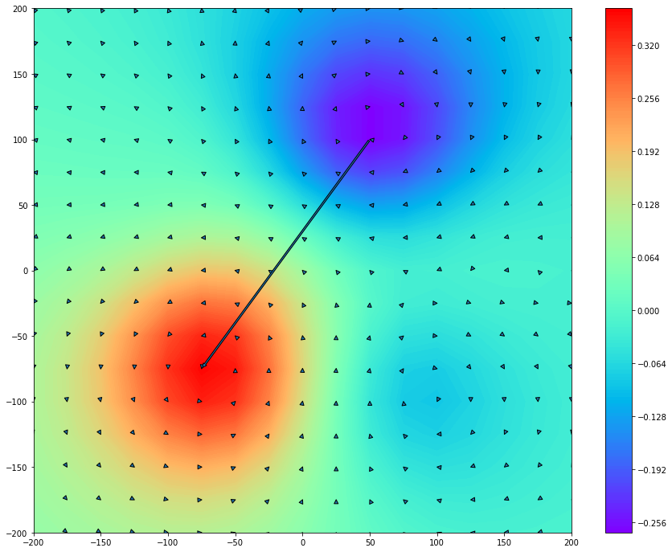

# Arrow Map

Although the [Field Map](https://pjjung.github.io/mcgpy/Visualization/Fieldmap.html) is a scalar dataset, current dipole distribution can be obtained by calculating the gradient on each cell. For this purpose, the `FieldMap` object provides the information of current arrows and a field pole arrow via `arrows()` and `pole()` methods.

Since their information is stored as `astropy.table` table, several steps are required to polt the Arrow Map. Following example is based on a randomly created dataset by `numpy` and used `matplotlib`.

## Get normal and tangential Field Maps

```python
>>> from mcgpy.timeseries import TimeSeriesArray
>>> from mcgpy.numeric import FieldMap
>>> import numpy as np
>>> source = np.random.random((64,1024))
>>> positions = [(x,y,0) for x in np.linspace(-240,240,8) for y in np.linspace(-240,240,8)]
>>> directions = np.vander(np.linspace(0,0,64),3)
>>> dataset = TimeSeriesArray(source=source, positions=positions, directions=directions, t0=0, sample_rate=1024)
>>> epoch_dataset = dataset.at(0)
>>> Bz = FieldMap(epoch_dataset)
>>> I = Bz.currents()
```

## Get the information of current and the pole arrows

```python
>>> arrows_info = Bz.arrows(normalize=True)
>>> print(arrows_info)
<QTable length=289>
    tail [2]                      head [2]                  ...        distance               angle       
                                                            ...          A m                   deg        
    float64                       float64                   ...        float64               float64      
---------------- ------------------------------------------ ... ---------------------- -------------------
-200.0 .. -200.0 -199.97231886896392 .. -200.03173392832403 ...  1.405140770179355e-11   48.90219319940143
-175.0 .. -200.0 -174.95987290696857 .. -200.03277605720874 ... 1.7288536738689093e-11   39.24216178913423
-150.0 .. -200.0 -149.94211658840587 .. -200.03288365171088 ...  2.221373259886304e-11  29.600970874872083
-125.0 .. -200.0 -124.91940414235607 .. -200.02704428456494 ... 2.8366900929366782e-11  18.549397931354616
-100.0 .. -200.0   -99.89696839768818 .. -200.0119855517868 ...  3.461143192185526e-11  6.6353309283519035
 -75.0 .. -200.0  -74.88433270277011 .. -199.98755720788955 ...  3.881855053338731e-11  -6.139923914333862
 -50.0 .. -200.0 -49.889719068935264 .. -199.95851881256343 ...  3.931563281813583e-11  -20.61334185009448
 -25.0 .. -200.0   -24.9155668122923 .. -199.93326542522965 ...  3.591127477829506e-11 -38.322252464628534
   0.0 .. -200.0 0.04408996224175425 .. -199.92005756492776 ... 3.0463215301695057e-11   -61.1223250722071
  25.0 .. -200.0   25.001835485662816 .. -199.9225877322705 ...  2.583819229946889e-11   -88.6417413684232
  50.0 .. -200.0   49.96991258695252 .. -199.93810160528204 ... 2.2965006249010528e-11 -115.92334087152777
  75.0 .. -200.0    74.9541161228128 .. -199.95957421993253 ...  2.040522328867382e-11 -138.61848327288334
 100.0 .. -200.0   99.95293929798622 .. -199.97980020168612 ...  1.708866117585782e-11 -156.76960759013545
 125.0 .. -200.0  124.96067815838208 .. -199.99438059625945 ... 1.3254220582293216e-11 -171.86704490238282
 150.0 .. -200.0  149.97092812140502 .. -200.00248245828382 ...  9.736009223719278e-12  175.11933206321967
 175.0 .. -200.0   174.97966097140406 .. -200.0057125561094 ... 7.0493374498980925e-12  164.31171513458463
 200.0 .. -200.0    199.9858278213182 .. -200.0064025381238 ... 5.1891614352136636e-12  155.68806577787495
-200.0 .. -175.0  -199.9726012419791 .. -175.04417989031938 ... 1.7346726656009182e-11  58.194318496544845
-175.0 .. -175.0  -174.9583988725216 .. -175.04787719748776 ... 2.1164052170242602e-11   49.01219357925647
-150.0 .. -175.0 -149.93676757496698 .. -175.05311803401713 ... 2.7556127478919716e-11    40.0317451629414
-125.0 .. -175.0 -124.90737495749306 .. -175.04961837992377 ... 3.5062430106783925e-11  28.177542997558902
-100.0 .. -175.0   -99.87718012282345 .. -175.0295212715798 ...  4.214978904192725e-11  13.515360878046911
 -75.0 .. -175.0  -74.85943540653658 .. -174.99118187226603 ...  4.699581020580927e-11    -3.5896683259775
 -50.0 .. -175.0   -49.86485581273417 .. -174.9429017578023 ...  4.895458854215875e-11  -22.90399415696121
 -25.0 .. -175.0  -24.89667631665922 .. -174.90016994081816 ...  4.794069555181633e-11  -44.01478462512318
             ...                                        ... ...                    ...                 ...
    0.0 .. 175.0  0.07743500183678054 .. 175.09306260204872 ... 4.0397108392210966e-11   -50.2370272415893
   25.0 .. 175.0     25.11189772222917 .. 175.0592833569958 ... 4.2254515413214435e-11 -27.914620313512447
   50.0 .. 175.0     50.12573678520827 .. 175.0096456040758 ... 4.2079132212031285e-11 -4.3867204510172275
   75.0 .. 175.0    75.11504974124594 .. 174.96153559546528 ... 4.0478507799496806e-11  18.486249167324814
  100.0 .. 175.0    100.08694560984694 .. 174.9298363514549 ...  3.728040947215361e-11  38.902947609216355
  125.0 .. 175.0   125.05360115526018 .. 174.92024033402313 ...  3.206575057234722e-11   56.09758303427284
  150.0 .. 175.0   150.02675608962414 .. 174.92803464260268 ... 2.5619376170673633e-11   69.60530662164686
  175.0 .. 175.0     175.0107066474462 .. 174.9430195552396 ...  1.934597441954906e-11   79.35818512826286
  200.0 .. 175.0     200.002906073179 .. 174.95097442538363 ...  1.638757315935333e-11   86.60766607817193
 -200.0 .. 200.0  -200.01155889402082 .. 200.01316750821366 ...  5.846464663878313e-12  -131.2777801258076
 -175.0 .. 200.0   -175.0128621295698 .. 200.01543073999264 ...  6.703084974422652e-12 -129.81253789854145
 -150.0 .. 200.0  -150.01438911685415 .. 200.02106395130272 ...    8.5120262139557e-12 -124.33759811870262
 -125.0 .. 200.0   -125.0153614001027 .. 200.02934881121996 ... 1.1053453674788519e-11 -117.62791613116748
 -100.0 .. 200.0  -100.01355813627043 .. 200.04069891222193 ... 1.4314154440939591e-11 -108.42459945643391
  -75.0 .. 200.0    -75.00537432798211 .. 200.0540082963793 ... 1.8110498677621346e-11  -95.68275534099766
  -50.0 .. 200.0   -49.98716612990017 .. 200.06572349358694 ... 2.2344823891764376e-11  -78.95085205033362
  -25.0 .. 200.0  -24.958154659842595 .. 200.07009678941574 ... 2.7240626323285054e-11 -59.164270775606454
    0.0 .. 200.0  0.07619143087919736 .. 200.06168679773657 ...  3.271153433695371e-11 -38.994637415530526
   25.0 .. 200.0    25.104596948781673 .. 200.0393128530757 ...  3.728570357026443e-11  -20.59877355025309
   50.0 .. 200.0    50.11613243871938 .. 200.00817271974248 ...  3.884692170218242e-11  -4.025504126985765
   75.0 .. 200.0    75.10754271744837 .. 199.97753283972654 ...  3.665959766644338e-11  11.800161349500426
  100.0 .. 200.0   100.08413795019683 .. 199.95575231286674 ...  3.172076809054885e-11   27.73963624735183
  125.0 .. 200.0    125.0557107946247 .. 199.94650619235952 ...  2.577185699540861e-11    43.8369853598751
  150.0 .. 200.0   150.03160623352406 .. 199.94799613017943 ... 2.0306171586517033e-11   58.71014847987613
  175.0 .. 200.0    175.01578781947123 .. 199.9553078158115 ...  1.581603696309956e-11   70.54388429868378
  200.0 .. 200.0   200.00702971238024 .. 199.95973253247462 ... 1.3639664136883761e-11    80.0973567603393
```

```python
>>> pole_info = Bz.pole()
>>> print(pole_info)
time min coordinate [2] max coordinate [2]    vector        distance            angle              ratio      
 s                                                             mm                deg                          
---- ------------------ ------------------ ----------- ------------------ ------------------ -----------------
 0.0      50.0 .. 100.0     -75.0 .. -75.0 (-125-175j) 215.05813167606567 125.53767779197439 1.349543578763341
```

## Add current and the pole arrows on the normal field map plot

```python
>>> import matplotlib.pyplot as plt
>>> import matplotlib.patches as mpatches
>>> fig, ax = plt.subplots(figsize=(15, 12))
>>> ctr = ax.contourf(Bz.X, Bz.Y, Bz, 200, cmap='rainbow')
>>> cbar = fig.colorbar(ctr)
>>> for arrow in arrows_info:
>>>     tail = arrow['tail']
>>>     head = arrow['head']
>>>     dipole =  mpatches.FancyArrowPatch(tail, head, mutation_scale=10)
>>>     ax.add_patch(dipole)
>>> pole = mpatches.FancyArrowPatch(pole_info['min coordinate'][0], pole_info['max coordinate'][0], mutation_scale=10)
>>> ax.add_patch(pole)
>>> ax.set_xlim(-200,200)
>>> ax.set_ylim(-200,200)
>>> plt.show()
```

[(plot)](https://github.com/pjjung/mcgpy/blob/gh-pages/imgs/visualization-arrowdmap-example.png)



## Add current and the pole arrows on the tangential field map plot

```python
>>> import matplotlib.pyplot as plt
>>> import matplotlib.patches as mpatches
>>> fig, ax = plt.subplots(figsize=(15, 12))
>>> ctr = ax.contourf(I.X, I.Y, I, 200, cmap='rainbow')
>>> cbar = fig.colorbar(ctr)
>>> for arrow in arrows_info:
>>>     tail = arrow['tail']
>>>     head = arrow['head']
>>>     dipole =  mpatches.FancyArrowPatch(tail, head, mutation_scale=10)
>>>     ax.add_patch(dipole)
>>> pole = mpatches.FancyArrowPatch(pole_info['min coordinate'][0], pole_info['max coordinate'][0], mutation_scale=10)
>>> ax.add_patch(pole)
>>> ax.set_xlim(-200,200)
>>> ax.set_ylim(-200,200)
>>> plt.show()
```

[(plot)](https://github.com/pjjung/mcgpy/blob/gh-pages/imgs/visualization-arrowdmap-example2.png)


## References

* [`mcgpy.timeseriesarray.TimeSeriesArray`](https://pjjung.github.io/mcgpy/Classes/TimeSeriesArray.html)
* [`mcgpy.numeric.FieldMap`](https://pjjung.github.io/mcgpy/Classes/FieldMap.html)
