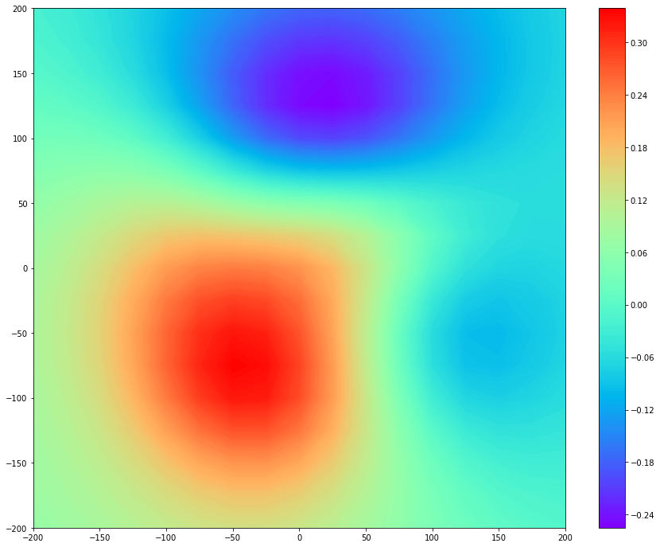

# Field Map

Based on multi-array magnetic information at the epoch, the field distribution can be generated. This page shows how to make a field map plot with randomly generated datasets by `numpy`.

```python
>>> from mcgpy.timeseries import TimeSeries, TimeSeriesArray
>>> from mcgpy.numeric import FieldMap
>>> import numpy as np
>>> source = np.random.random((64,1024))
>>> positions = [(x,y,0) for x in np.linspace(-240,240,8) for y in np.linspace(-240,240,8)]
>>> directions = np.vander(np.linspace(0,0,64),3)
>>> dataset = TimeSeriesArray(source=source, positions=positions, directions=directions, t0=0, sample_rate=1024)
>>> epoch_dataset = dataset.at(0)
>>> Bz = FieldMap(epoch_dataset)
>>> import matplotlib.pyplot as plt
>>> fig, ax = plt.subplots(figsize=(15, 12))
>>> ctr = ax.contourf(Bz.X, Bz.Y, Bz, 200, cmap='rainbow')
>>> cbar = fig.colorbar(ctr)
>>> plt.show()
```
[(plot)]()



```tip
The area of the actual sensor arrangement is bigger than the virtual sensor grid zone.
```

## References

* [`mcgpy.timeseriesarray.TimeSeriesArray`](https://pjjung.github.io/mcgpy/Classes/TimeSeriesArray.html)
* [`mcgpy.numeric.FieldMap`](https://pjjung.github.io/mcgpy/Classes/FieldMap.html)
