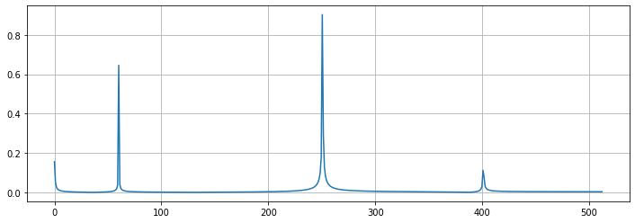
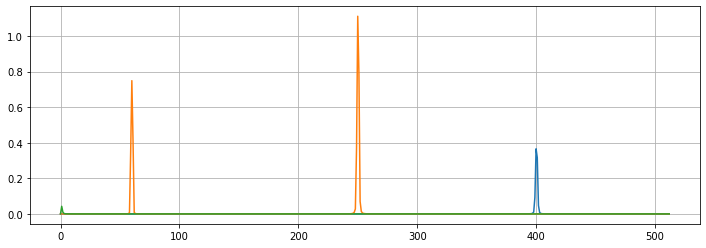

# Frequency Series

The `FrequencySeries` ojbect is designed to represent frequency domain datasets, such as fast Fourier transform (FFT) and power spectral density (PSD). Therefore, this page will be helpful to represent them by [matplotlib](https://matplotlib.org/).

## Single channe data plot

```python
>>> from mcgpy.timeseries import TimeSeries
>>> import numpy as np
>>> t = np.linspace(0,1,1024)
>>> source = 0.3*np.sin(400*2*np.pi*t) + 1.3*np.sin(60*2*np.pi*t) + 2*np.sin(500*np.pi*t) + np.sin(0.1*np.pi*t) 
>>> data = TimeSeries(source, t0=0, sample_rate=1024)
>>> fs = data.fft()
>>> from matplotlib import pyplot as plt
>>> fig, ax = plt.subplots(1, figsize=(12, 4))
>>> ax.plot(fs.frequencies.value, fs)
>>> ax.grid(True)
>>> plt.show() 
```
[(plot)](https://github.com/pjjung/mcgpy/blob/gh-pages/imgs/visualization-frequencyseries-example.png)



## Multi channel dataset plot

```python
>>> from mcgpy.timeseries import TimeSeriesArray
>>> import numpy as np
>>> t = np.linspace(0,1,1024)
>>> source = [0.7*np.sin(400*2*np.pi*t), 
              1.3*np.sin(60*2*np.pi*t) + 2*np.sin(500*np.pi*t),
              np.sin(0.1*np.pi*t)]
>>> positions = np.random.random((3,3))
>>> directions = np.vander(np.linspace(0,0,3),3)
>>> dataset = TimeSeriesArray(source=source, positions=positions, directions=directions, t0=0, sample_rate=1024)
>>> fss = dataset.asd(1,0.5)
>>> fig, ax = plt.subplots(1, figsize=(12, 4))
>>> ax.plot(fss.frequencies.value, fss.T)
>>> ax.grid(True)
>>> plt.show() 
```
[(plot)](https://github.com/pjjung/mcgpy/blob/gh-pages/imgs/visualization-frequencyseries-example2.png)



## References

* [`mcgpy.timeseries.TimeSeries`](https://pjjung.github.io/mcgpy/Classes/TimeSeries.html)
* [`mcgpy.timeseriesarray.TimeSeriesArray`](https://pjjung.github.io/mcgpy/Classes/TimeSeriesArray.html)
* [`mcgpy.series.FrequencySeries`](https://pjjung.github.io/mcgpy/Classes/FrequencySeries.html)
