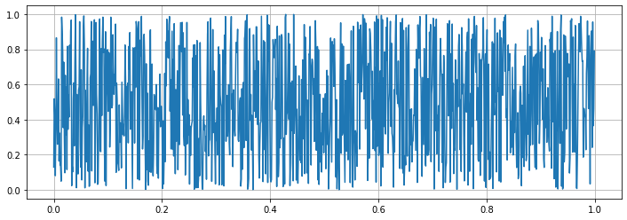
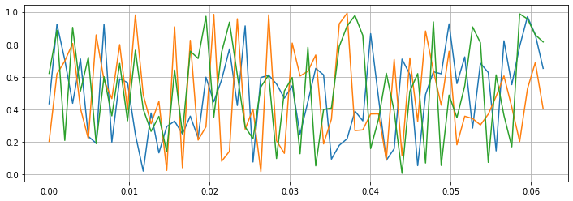

# TimeSeries

MCGpy deals with two types of time-series datasets: 1) a single-channel signal measured, and 2) multi-channel signals. This page provides simple examples showing how to plot each type by [matplotlib](https://matplotlib.org/).

## Single channel data plot

```python
>>> from mcgpy.timeseries import TimeSeries
>>> import numpy as np
>>> source = np.random.random(1024)
>>> data = TimeSeries(source, t0=0, sample_rate=1024)
>>> from matplotlib import pyplot as plt
>>> fig, ax = plt.subplots(1, figsize=(12, 4))
>>> ax.plot(data.times.value, data)
>>> ax.grid(True)
>>> plt.show() 
```
[(plot)](https://github.com/pjjung/mcgpy/blob/gh-pages/imgs/visualization-timeseries-example.png)



## Multi channel dataset plot

```python
>>> from mcgpy.timeseries import TimeSeriesArray
>>> import numpy as np
>>> source = np.random.random((3,64))
>>> positions = np.random.random((3,3))
>>> directions = np.vander(np.linspace(0,0,3),3)
>>> dataset = TimeSeriesArray(source=source, positions=positions, directions=directions, t0=0, sample_rate=1024)
>>> from matplotlib import pyplot as plt
>>> fig, ax = plt.subplots(1, figsize=(12, 4))
>>> ax.plot(dataset.times.value, dataset.T)
>>> ax.grid(True)
>>> plt.show() 
```
[(plot)](https://github.com/pjjung/mcgpy/blob/gh-pages/imgs/visualization-timeseriesarray-example.png)



## References

* [`mcgpy.timeseries.TimeSeries`](https://pjjung.github.io/mcgpy/Classes/TimeSeries.html)
* [`mcgpy.timeseriesarray.TimeSeriesArray`](https://pjjung.github.io/mcgpy/Classes/TimeSeriesArray.html)
* [`mcgpy.series.FrequencySeries`](https://pjjung.github.io/mcgpy/Classes/FrequencySeries.html)
